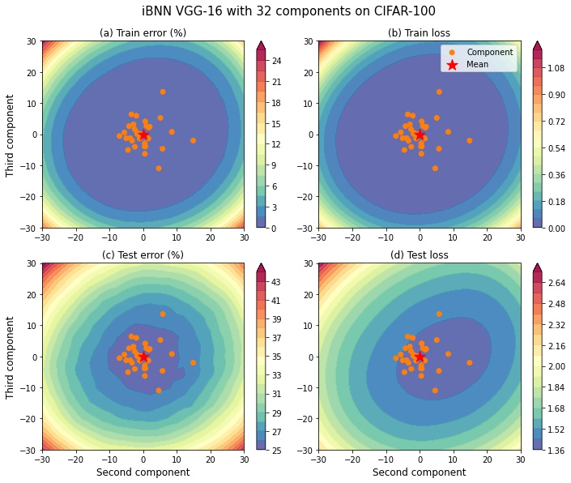

# iBNN

Official Pytorch implementation of the implicit BNN model from the paper

[Scalable Bayesian neural networks by layer-wise input augmentation](https://arxiv.org/abs/2010.13498)

by Trung Trinh, Samuel Kaski, Markus Heinonen

VGG-16             |  WideResNet28x10
:-------------------------:|:-------------------------:
|||

## Installation

```bash
pip install -r requirements.txt
```

## File Structure

```
.
+-- models/ (Folder containing all model definitions)
|   +-- resnet.py (containing the WideResNet model)
|   +-- vgg.py (containing the VGG model)
|   +-- utils.py (utility functions and modules)
+-- datasets.py (containing functions to load data)
+-- train.py (script for single-gpu training)
+-- multi_gpu_train.py (script for multi-gpu training)
+-- test.py (script for testing)
+-- ood_test.py (script for out-of-distribution testing)
```

## Command to replicate the result

Training WideResNet-28x10 on CIFAR-10
```bash
python train.py with  model_name=StoWideResNet28x10 validation=False \
        num_epochs=300 validate_freq=15 logging_freq=1 'kl_weight.kl_min=0.0' 'kl_weight.kl_max=1.0' 'kl_weight.last_iter=200' \
        lr_ratio_det=0.01 lr_ratio_sto=1.0 prior_std=0.1 prior_mean=1.0 'det_params.weight_decay=5e-4' \
        num_test_sample=1 dropout=0.0 n_components=<NUMBER_OF_COMPONENTS> dataset=cifar10 \
        'det_params.lr=0.1' 'sto_params.lr'=2.4 'sto_params.weight_decay=0.0' \
        'sto_params.momentum=0.9' 'sto_params.nesterov=True' num_train_sample=2 \
        'sgd_params.nesterov'=True 'milestones=(0.50,0.90)' name=<UNIQUE_NAME_FOR_THE_EXPERIMENT> seed=<RANDOM_SEED>
```
Training WideResNet-28x10 on CIFAR-100
```bash
python train.py with  model_name=StoWideResNet28x10 validation=False \
        num_epochs=300 validate_freq=15 logging_freq=1 'kl_weight.kl_min=0.0' 'kl_weight.kl_max=1.0' 'kl_weight.last_iter=200' \
        lr_ratio_det=0.01 lr_ratio_sto=1.0 prior_std=0.1 prior_mean=1.0 'det_params.weight_decay=5e-4' \
        num_test_sample=1 dropout=0.0 n_components=<NUMBER_OF_COMPONENTS> dataset=cifar100 seed=<RANDOM_SEED> \
        'det_params.lr=0.1' 'sto_params.momentum=0.9' 'sto_params.nesterov=True' 'sto_params.lr'=4.8 'sto_params.weight_decay=0.0' 'num_train_sample'=2 \
        'sgd_params.nesterov'=True 'milestones=(0.50,0.90)' name=<UNIQUE_NAME_FOR_THE_EXPERIMENT>
```
Training VGG16 on CIFAR-10
```bash
python train.py with model_name=StoVGG16 validation=False \
        num_epochs=300 validate_freq=15 logging_freq=1 'kl_weight.kl_min=0.0' 'kl_weight.kl_max=1.0' 'kl_weight.last_iter=200' \
        lr_ratio_det=0.01 lr_ratio_sto=1.0 prior_std=0.3 prior_mean=1.0 'det_params.weight_decay=5e-4' num_test_sample=1 \
        n_components=<NUMBER_OF_COMPONENTS> dataset=vgg_cifar10 'posterior_mean_init=(1.0,0.75)' \
        'det_params.lr=0.05' 'sto_params.lr'=1.2 'sto_params.weight_decay=0.0' 'sto_params.momentum=0.9' 'sto_params.nesterov=True' 'num_train_sample'=2 \
        'sgd_params.nesterov'=True 'milestones=(0.50,0.90)' name=<UNIQUE_NAME_FOR_THE_EXPERIMENT> seed=<RANDOM_SEED>
```
Training VGG16 on CIFAR-100
```bash
python train.py with model_name=StoVGG16 validation=False \
    num_epochs=300 validate_freq=15 logging_freq=1 'kl_weight.kl_min=0.0' 'kl_weight.kl_max=1.0' 'kl_weight.last_iter=200' \
    lr_ratio_det=0.01 lr_ratio_sto=1.0 prior_std=0.3 prior_mean=1.0 'det_params.weight_decay=3e-4' num_test_sample=1 \
    n_components=<NUMBER_OF_COMPONENTS> dataset=vgg_cifar100 'posterior_mean_init=(1.0,0.75)' 'posterior_std_init=(0.05,0.02)' \
    'det_params.lr=0.05' 'sto_params.lr'=1.6 'sto_params.weight_decay=0.0' 'sto_params.momentum=0.9' 'sto_params.nesterov=True' 'num_train_sample'=2 \
    'sgd_params.nesterov'=True 'milestones=(0.50,0.90)' name=<UNIQUE_NAME_FOR_THE_EXPERIMENT> seed=<RANDOM_SEED>
```
For more information on each training option, please read the comments in the `train.py` file.
Each experiment will be stored in a subfolder of the `experiments` folder.

To test the model
```bash
python test.py <EXPERIMENT_FOLDER> -n 5 -b 128
```
where `-n` option defines the number of samples to use in each component, and `-b` option defines the batch size. The test result will be in the `<EXPERIMENT_FOLDER>/<DATASET>/result.json` file.

## Multi-gpus training
We can train the iBNN on multi-gpus on single node via `nn.parallel.DistributedDataParallel` from Pytorch to speed up the training time and allow us to increase the number of posterior components since the training complexity scales linearly with respect to the number of components.

Training VGG16 with 48 components on CIFAR-100
```bash
python multi_gpu_train.py --seed <SEED> --model StoVGG16 --kl_weight "{'kl_min':0.0,'kl_max':1.0,'last_iter':200}" \
        --batch_size "{'train':256,'test':100}" --root <ROOT_DIR> \
        --prior "{'mean':1.0,'std':0.3}" --n_components 48 \
        --det_params "{'lr':0.1,'weight_decay':0.0003}" --sto_params "{'lr':19.2,'weight_decay':0.0}" \
        --sgd_params "{'momentum':0.9,'nesterov':True,'dampening':0.0}" --num_sample "{'train':6,'test':1}" \
        --dataset vgg_cifar100 --lr_ratio "{'det':0.01,'sto':1.0}" \
        --posterior "{'mean_init':(1.0,0.75),'std_init':(0.05,0.02)}" --milestones 0.5 0.9 \
        --nodes 1 --gpus <NUM_GPUS> --nr 0 --num_epochs 300
```
Training VGG16 with 64 components on CIFAR-100
```bash
python multi_gpu_train.py --seed <SEED> --model StoVGG16 --kl_weight "{'kl_min':0.0,'kl_max':1.0,'last_iter':200}" \
        --batch_size "{'train':256,'test':100}" --root <ROOT_DIR> \
        --prior "{'mean':1.0,'std':0.3}" --n_components 64 \
        --det_params "{'lr':0.1,'weight_decay':0.0003}" --sto_params "{'lr':25.6,'weight_decay':0.0}" \
        --sgd_params "{'momentum':0.9,'nesterov':True,'dampening':0.0}" --num_sample "{'train':8,'test':1}" \
        --dataset vgg_cifar100 --lr_ratio "{'det':0.01,'sto':1.0}" \
        --posterior "{'mean_init':(1.0,0.75),'std_init':(0.05,0.02)}" --milestones 0.5 0.9 \
        --nodes 1 --gpus <NUM_GPUS> --nr 0 --num_epochs 300
```
Training WideResNet28x10 with 32 components on CIFAR-100
```bash
python multi_gpu_train.py --seed <SEED> --model StoWideResNet28x10 --kl_weight "{'kl_min':0.0,'kl_max':1.0,'last_iter':200}" \
        --batch_size "{'train':128,'test':100}" --root <ROOT_DIR> --prior "{'mean':1.0,'std':0.1}" \
        --n_components 32 --det_params "{'lr':0.1,'weight_decay':0.0005}" --sto_params "{'lr':19.2,'weight_decay':0.0}" \
        --sgd_params "{'momentum':0.9,'nesterov':True,'dampening':0.0}" --num_sample "{'train':4,'test':1}" \
        --dataset cifar100 --lr_ratio "{'det':0.01,'sto':1.0}" \
        --posterior "{'mean_init':(1.0,0.75),'std_init':(0.05,0.02)}" --milestones 0.5 0.9 \
        --nodes 1 --gpus <NUM_GPUS> --nr 0 --num_epochs 300
```
After training, folder `<ROOT_DIR>` will have 3 files: `checkpoint.pt`, `config.json` and `train.log`.
Table belows compares the runtime between experiments with different number of GPUs:

| Model           | Dataset   | #components | GPU               | Runtime | Test NLL | Tess accuracy (%) |
|-----------------|-----------|-------------|-------------------|---------|----------|-------------------|
| VGG16           | CIFAR-100 | 48          | 1xTesla V100 32gb | 4h28m   | 0.9378   | 75.57             |
| VGG16           | CIFAR-100 | 48          | 2xTesla V100 32gb | 2h44m   | 0.9302   | 75.15             |
| VGG16           | CIFAR-100 | 48          | 4xTesla P100 16gb | 3h03m   | 0.9444   | 75.47             |
| VGG16           | CIFAR-100 | 64          | 4xTesla V100 32gb | 2h58m   | 0.9278   | 75.40             |
| WideResNet28x10 | CIFAR-100 | 32          | 1xTesla V100 32gb | 33h33m  | 0.6298   | 83.02             |
| WideResNet28x10 | CIFAR-100 | 32          | 2xTesla V100 32gb | 19h55m  | 0.6261   | 82.99             |

We can see that using more GPUs allow us to shorten the runtime while maintaining the model performance within a certain range (the difference in performance is due to the randomness during training.)

## Note on how to create new model

Currently, only `Linear` and `Conv2d` are supported. Replace every `Linear` layer with `StoLinear` and every `Conv2d` with `StoConv2d`

```python
class StoLeNet(nn.Module):
    def __init__(self, n_components, 
                 prior_mean=1.0, prior_std=0.3, 
                 posterior_mean_init=(1.0,0.5), 
                 posterior_std_init=(0.05,0.02)):
        super(StoLeNet, self).__init__()
        self.conv1 = StoConv2d(1, 6, kernel_size=5,
                               n_components=n_components, 
                               prior_mean=prior_mean, prior_std=prior_std,
                               posterior_mean_init=posterior_mean_init,
                               posterior_std_init=posterior_std_init)
        self.act1 = nn.ReLU(True)
        self.maxpool1 = nn.MaxPool2d(2)
        self.conv2 = StoConv2d(6, 16, kernel_size=5,
                               n_components=n_components, 
                               prior_mean=prior_mean, prior_std=prior_std,
                               posterior_mean_init=posterior_mean_init,
                               posterior_std_init=posterior_std_init)
        self.act2 = nn.ReLU(True)
        self.maxpool2 = nn.MaxPool2d(2)
        self.conv3 = StoConv2d(16, 120, kernel_size=4,
                               n_components=n_components, 
                               prior_mean=prior_mean, prior_std=prior_std,
                               posterior_mean_init=posterior_mean_init,
                               posterior_std_init=posterior_std_init)
        self.act3 = nn.ReLU(True)
        self.fc1 = StoLinear(120, 64, 
                             n_components=n_components, 
                             prior_mean=prior_mean, prior_std=prior_std, 
                             posterior_mean_init=posterior_mean_init, 
                             posterior_std_init=posterior_std_init)
        self.act3 = nn.ReLU(True)
        self.fc2 = StoLinear(64, 10, 
                             n_components=n_components, 
                             prior_mean=prior_mean, prior_std=prior_std, 
                             posterior_mean_init=posterior_mean_init, 
                             posterior_std_init=posterior_std_init)
        self.n_components = n_components
        # Collect the stochastic modules to calculate KL term
        self.sto_modules = [
            m for m in self.modules() if isinstance(m, StoLayer)
        ]
    
    def kl(self):
        return sum(m.kl() for m in self.sto_modules)
    
    def vb_loss(self, x, y, n_sample):
        y = y.unsqueeze(1).expand(-1, n_sample)
        logp = D.Categorical(logits=self.forward(x, n_sample)).log_prob(y).mean()
        return -logp, self.kl()
    
    def nll(self, x, y, n_sample):
        indices = torch.empty(x.size(0)*n_sample, dtype=torch.long, device=x.device)
        # For evaluation, we drawn n_sample from each component
        prob = torch.cat([
            self.forward(x, n_sample, 
                         indices=torch.full((x.size(0)*n_sample,), 
                                            idx, out=indices, device=x.device, dtype=torch.long))
            for idx in range(self.n_components)
        ], dim=1)
        logp = D.Categorical(logits=prob).log_prob(y.unsqueeze(1).expand(-1, self.n_components*n_sample))
        logp = torch.logsumexp(logp, 1) - torch.log(torch.tensor(self.n_components*n_sample, dtype=torch.float32, device=x.device))
        return -logp.mean(), prob
    
    def forward(self, x, L=1, indices=None):
        if L > 1:
            x = torch.repeat_interleave(x, L, 0)
        # indices assign each sample in the batch with a component
        # by default, we will divide the sample evenly between component via module (%)
        # combine this with torch.repeat_interleave above we can update each component
        # using a different subset of a batch.
        if indices is None:
            indices = torch.arange(x.size(0), dtype=torch.long, device=x.device) % self.n_components
        x = self.conv1(x, indices)
        x = self.act1(x)
        x = self.maxpool1(x)
        
        x = self.conv2(x, indices)
        x = self.act2(x)
        x = self.maxpool2(x)
        
        x = self.conv3(x, indices)
        x = self.act3(x)
        
        x = x.view(x.size(0), -1)
        x = self.fc1(x, indices)
        x = self.act3(x)
        x = self.fc2(x, indices)
        return F.log_softmax(x, dim=-1).view(-1, L, x.size(-1))
```
Copy the code for `vb_loss` and `nll` above to your model and change the distribution accordingly (for regression, change from `D.Categorical` to `D.Normal`)

For training:
```python
# Create a model with 8 components
model = StoLeNet(n_components=8)
det_p = [] # list of deterministic weights
sto_p = [] # list of variational parameters
for name, param in model.named_parameters():
    if 'posterior' in name or 'prior' in name:
        sto_p.append(param)
    else:
        det_p.append(param)
# We use larger learning rate lr2 for the variational parameters
# A rule of thumbs is that lr2 equals a base value times the number of components.
# For example, below we choose a base value of 0.2 and multiply it with 8.
# Use a suitable large lr for variational params so they can quickly adapt to the change of deterministic weights.
optimizer = torch.optim.SGD(
[{
    'params': det_p,
    'lr': 0.1
},{
    'params': sto_p,
    'lr': 0.2*8
}], momentum=0.9, nesterov=True)
# Optional: define a scheduler for the learning rate of each param group.
# Usually, we don't need to anneal the learning rate of the variational parameters.
scheduler = torch.optim.lr_scheduler.LambdaLR(optimizer, 
                                             [lambda e: schedule(num_epochs, e, milestones, lr_ratio_det), 
                                             lambda e: schedule(num_epochs, e, milestones, lr_ratio_sto)])
```

During training, the KL weight increases from 0 to 1 for some epochs. In my experiment, for a run of 300 epochs, I perform KL weight anneal for 200 epochs, but this value can change depend on your application.

It is important to initilize the means of the posterior components using `Normal(1, sigma)` with a suitable `sigma` value (0.75 or 0.5 works fine) and choose a suitable standard deviation for the prior `Normal(1, s)`, for small network `s = 0.3` is a good value.